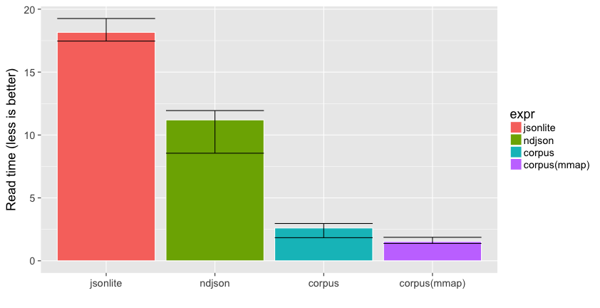
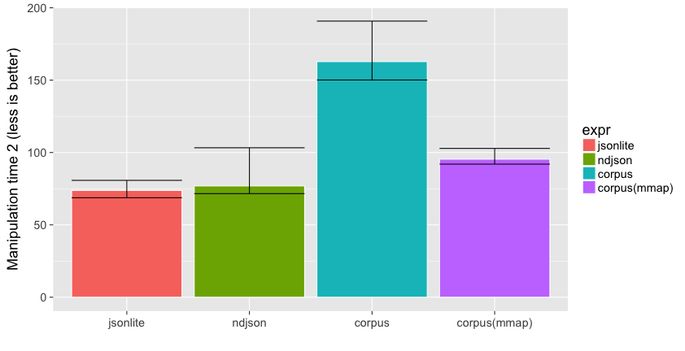
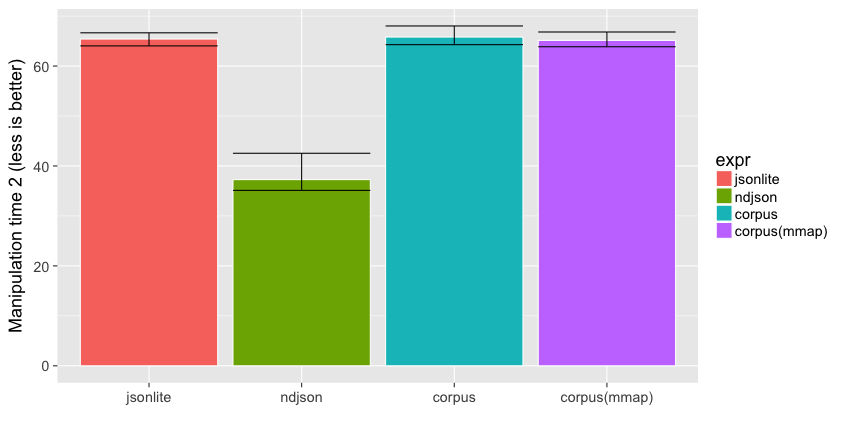

# NDJSON speed contest

We benchmark several R packages that read [ndjson](http://ndjson.org/) data into a data frame. 


__Important__: these packages are not fully interchangable. They have varying features and return different structures. Some support nested data, user interruption, stream-processing incremental results, etc. Anyway...

## Prepare

Required packages:


```r
install.packages(c("nycflights13", "dplyr", "ggplot2", "microbenchmark", "jsonlite", "ndjson", "corpus"))
```


```r
options(stringsAsFactors = FALSE)
sessionInfo()
```

```
R version 3.4.0 (2017-04-21)
Platform: x86_64-apple-darwin15.6.0 (64-bit)
Running under: macOS Sierra 10.12.5

Matrix products: default
BLAS: /System/Library/Frameworks/Accelerate.framework/Versions/A/Frameworks/vecLib.framework/Versions/A/libBLAS.dylib
LAPACK: /Library/Frameworks/R.framework/Versions/3.4/Resources/lib/libRlapack.dylib

locale:
[1] en_US.UTF-8/en_US.UTF-8/en_US.UTF-8/C/en_US.UTF-8/en_US.UTF-8

attached base packages:
[1] stats     graphics  grDevices utils     datasets  methods   base     

other attached packages:
[1] ggplot2_2.2.1 dplyr_0.5.0   knitr_1.16   

loaded via a namespace (and not attached):
 [1] Rcpp_0.12.11     magrittr_1.5     munsell_0.4.3    colorspace_1.3-2 R6_2.2.1         rlang_0.1.1     
 [7] stringr_1.2.0    highr_0.6        plyr_1.8.4       tools_3.4.0      grid_3.4.0       gtable_0.2.0    
[13] DBI_0.6-1        htmltools_0.3.6  lazyeval_0.2.0   assertthat_0.2.0 rprojroot_1.2    digest_0.6.12   
[19] tibble_1.3.1     rsconnect_0.8    evaluate_0.10    rmarkdown_1.5    stringi_1.1.5    compiler_3.4.0  
[25] scales_0.4.1     backports_1.1.0 
```

We also need some test data:


```r
# Generate some NDJSON
test <- tempfile()
jsonlite::stream_out(nycflights13::flights, file(test), verbose = FALSE)
```

## Reading from disk

First benchmark reading time:


```r
# Reading speed (takes a few minutes !!)
read_speed <- microbenchmark::microbenchmark (
  jsonlite = flights1 <- jsonlite::stream_in(file(test), verbose = FALSE),
  ndjson = flights2 <- ndjson::stream_in(test),
  corpus = flights3 <- corpus::read_ndjson(test),
  "corpus(mmap)" = flights4 <- corpus::read_ndjson(test, mmap = TRUE),
  times = 3
)
print(read_speed)
```

```
Unit: seconds
         expr       min        lq      mean    median        uq       max neval
     jsonlite 17.465073 17.812930 18.294812 18.160788 18.709681 19.258575     3
       ndjson  8.551977  9.876017 10.564287 11.200058 11.570442 11.940827     3
       corpus  1.837616  2.222862  2.470231  2.608108  2.786539  2.964970     3
 corpus(mmap)  1.380170  1.456049  1.593488  1.531928  1.700147  1.868366     3
```

```r
read_data <- summary(read_speed)

# Plot
library(ggplot2)
ggplot(read_data, aes(x = expr, fill = expr, y = median, ymin = min, ymax = max)) + 
  geom_bar(color = "white", stat = "identity") + geom_errorbar() +
  xlab("") + ylab("Read time (less is better)")
```



## Working example 1

Now benchmark how long it takes to perform operations on the data returned by the readers. 
We use an example from the [dplyr vignette](https://cran.rstudio.com/web/packages/dplyr/vignettes/introduction.html) to benchmark some random operations on the `flights` dataset.


```r
library(dplyr)
```


```r
# Test data manipulation
work_function <- function(fldata){
  fldata %>%
  group_by(year, month, day) %>%
  select(arr_delay, dep_delay) %>%
  summarise(
    arr = mean(arr_delay, na.rm = TRUE),
    dep = mean(dep_delay, na.rm = TRUE)
  ) %>%
  filter(arr > 30 | dep > 30)
}

# Run benchmark timers
results <- microbenchmark::microbenchmark (
  jsonlite = work_function(flights1),
  ndjson = work_function(flights2),
  corpus = work_function(flights3),
  "corpus(mmap)" = work_function(flights4),
  times = 100
)

# Present results
print(results)
```

```
Unit: milliseconds
         expr      min       lq     mean   median       uq       max neval
     jsonlite 14.56588 16.19524 18.93383 18.90781 20.29780  46.70143   100
       ndjson 52.85495 68.82448 81.12051 75.83665 85.72882 237.58117   100
       corpus 14.68139 16.30600 18.94647 18.34751 20.04423  76.21080   100
 corpus(mmap) 14.59073 15.85064 17.99070 17.76591 20.00765  24.14109   100
```

```r
work_data <- summary(results)
ggplot(work_data, aes(x = expr, fill = expr, y = median, ymin = lq, ymax = uq)) + 
  geom_bar(color = "white", stat = "identity") + geom_errorbar() +
  xlab("") + ylab("Manipulation time 1 (less is better)")
```



## Working example 2

Let's try another example function that also involves strings `tailnum`:


```r
work_function <- function(fldata){
  by_tailnum <- group_by(fldata, tailnum)
  delay <- summarise(by_tailnum,
    count = n(),
    dist = mean(distance, na.rm = TRUE),
    delay = mean(arr_delay, na.rm = TRUE))
  filter(delay, count > 20, dist < 2000)  
}
# Run benchmark timers
results <- microbenchmark::microbenchmark (
  jsonlite = work_function(flights1),
  ndjson = work_function(flights2),
  corpus = work_function(flights3),
  "corpus(mmap)" = work_function(flights4),
  times = 100
)

# Present results
print(results)
```

```
Unit: milliseconds
         expr      min       lq     mean   median       uq      max neval
     jsonlite 60.90102 64.03197 66.28742 65.40403 66.64907 123.4093   100
       ndjson 25.70644 35.11290 43.46404 37.26581 42.54079 104.1210   100
       corpus 60.70241 64.27781 67.56528 65.79940 68.02163 122.0678   100
 corpus(mmap) 60.88245 63.86023 65.96790 65.12887 66.81371 121.8869   100
```

```r
work_data <- summary(results)
ggplot(work_data, aes(x = expr, fill = expr, y = median, ymin = lq, ymax = uq)) + 
  geom_bar(color = "white", stat = "identity") + geom_errorbar() +
  xlab("") + ylab("Manipulation time 2 (less is better)")
```


