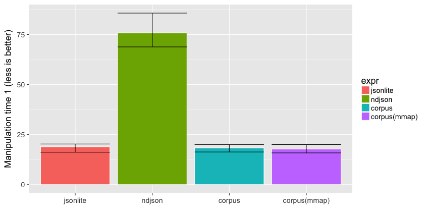

# NDJSON speed contest

We benchmark several R packages that read [ndjson](http://ndjson.org/) data into a data frame. 


__Important__: these packages are not fully interchangable. They have varying features and return different structures. Some support nested data, user interruption, stream-processing incremental results, etc. Anyway...

## Prepare

Required packages:


```r
install.packages(c("nycflights13", "dplyr", "ggplot2", "microbenchmark", "jsonlite", "ndjson", "corpus"))
```

We also need some test data:


```r
# Generate some NDJSON
test <- tempfile()
jsonlite::stream_out(nycflights13::flights, file(test), verbose = FALSE)
```

## Reading from disk

First benchmark reading time:


```r
# Reading speed (takes a few minutes !!)
read_speed <- microbenchmark::microbenchmark (
  jsonlite = flights1 <- jsonlite::stream_in(file(test), verbose = FALSE),
  ndjson = flights2 <- ndjson::stream_in(test),
  corpus = flights3 <- corpus::read_ndjson(test),
  "corpus(mmap)" = flights4 <- corpus::read_ndjson(test, mmap = TRUE),
  times = 3
)
print(read_speed)
```

```
Unit: seconds
         expr       min        lq      mean    median        uq       max neval
     jsonlite 18.752164 18.845512 19.077748 18.938861 19.240540 19.542220     3
       ndjson  8.828158  9.183294  9.552292  9.538430  9.914359 10.290287     3
       corpus  2.000350  2.008242  2.168389  2.016134  2.252409  2.488684     3
 corpus(mmap)  1.353021  1.451502  1.690727  1.549982  1.859580  2.169177     3
```

```r
read_data <- summary(read_speed)

# Plot
library(ggplot2)
ggplot(read_data, aes(x = expr, fill = expr, y = median, ymin = min, ymax = max)) + 
  geom_bar(color = "white", stat = "identity") + geom_errorbar() +
  xlab("") + ylab("Read time (less is better)")
```


## Working example 1

Now benchmark how long it takes to perform operations on the data returned by the readers. 
We use an example from the [dplyr vignette](https://cran.rstudio.com/web/packages/dplyr/vignettes/introduction.html) to benchmark some random operations on the `flights` dataset.


```r
library(dplyr)
```


```r
# Test data manipulation
work_function <- function(fldata){
  fldata %>%
  group_by(year, month, day) %>%
  select(arr_delay, dep_delay) %>%
  summarise(
    arr = mean(arr_delay, na.rm = TRUE),
    dep = mean(dep_delay, na.rm = TRUE)
  ) %>%
  filter(arr > 30 | dep > 30)
}

# Run benchmark timers
results <- microbenchmark::microbenchmark (
  jsonlite = work_function(flights1),
  ndjson = work_function(flights2),
  corpus = work_function(flights3),
  "corpus(mmap)" = work_function(flights4),
  times = 100
)

# Present results
print(results)
```

```
Unit: milliseconds
         expr      min       lq     mean   median       uq       max neval
     jsonlite 14.57813 16.93738 18.64039 18.68784 20.15864  25.05570   100
       ndjson 54.88622 67.17088 81.50083 73.79354 77.82895 165.98549   100
       corpus 14.65491 16.58606 18.74153 18.96093 19.92020  36.04901   100
 corpus(mmap) 14.42795 16.80320 18.82784 18.88370 20.23105  42.47390   100
```

```r
work_data <- summary(results)
ggplot(work_data, aes(x = expr, fill = expr, y = median, ymin = lq, ymax = uq)) + 
  geom_bar(color = "white", stat = "identity") + geom_errorbar() +
  xlab("") + ylab("Manipulation time 1 (less is better)")
```


## Working example 2

Let's try another example function that also involves strings `tailnum`:


```r
work_function <- function(fldata){
  by_tailnum <- group_by(fldata, as.character(tailnum))
  delay <- summarise(by_tailnum,
    count = n(),
    dist = mean(distance, na.rm = TRUE),
    delay = mean(arr_delay, na.rm = TRUE))
  filter(delay, count > 20, dist < 2000)  
}
# Run benchmark timers
results <- microbenchmark::microbenchmark (
  jsonlite = work_function(flights1),
  ndjson = work_function(flights2),
  corpus = work_function(flights3),
  "corpus(mmap)" = work_function(flights4),
  times = 100
)

# Present results
print(results)
```

```
Unit: milliseconds
         expr       min        lq      mean    median        uq      max neval
     jsonlite  65.41017  68.75156  75.28772  73.79326  80.75959 102.8780   100
       ndjson  63.04098  71.60251  91.38377  76.90047 103.27820 255.2030   100
       corpus 118.82503 150.10638 173.24598 162.80004 190.80678 346.1251   100
 corpus(mmap)  84.91291  91.97479 100.47743  95.39058 102.82636 311.7818   100
```

```r
work_data <- summary(results)
ggplot(work_data, aes(x = expr, fill = expr, y = median, ymin = lq, ymax = uq)) + 
  geom_bar(color = "white", stat = "identity") + geom_errorbar() +
  xlab("") + ylab("Manipulation time 2 (less is better)")
```


